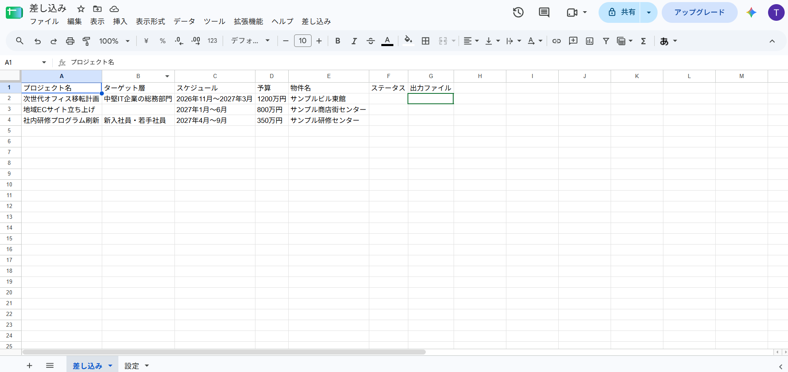
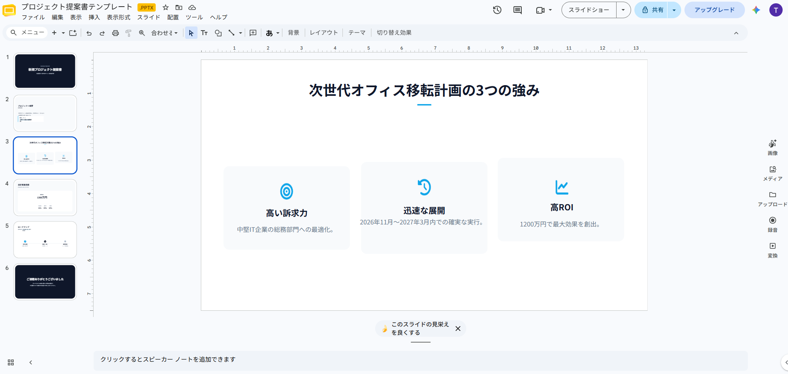

# slides-filler-demo

スライドのテンプレートに含まれるプレースホルダ（`{{キー}}`）を、外から渡した値で差し替え、
編集できるファイル（`.pptx`）として書き出す汎用の差し込みエンジン。

不動産・議事録・提案書など、案件固有の項目名は一切使っていない、使い回せる資産です。

## デモの構成

- **入力**: Googleスプレッドシート（値を入れる「差し込み」シートと、テンプレートID等を書く「設定」シート）
- **エンジン**: Googleのサービスを一切呼ばない純粋関数（`src/fill.gs`）。Node標準テストランナーでテスト済み
- **境界層**: Drive APIでテンプレートを複製 → Slides API の `batchUpdate`（`replaceAllText`）で置換 →
  Driveのエクスポート機能で `.pptx` を書き出し（`src/Code.gs`）

Apps Script完結（Google Slides API + Drive API）で動くため、サーバーは不要です。

## 使い方

1. Google スライドでテンプレートを作る。差し替えたい箇所に `{{キー}}` と書く
2. スプレッドシートの「差し込み」シートに、1行目にキー名（`{{}}` は付けない）、2行目以降に値を入れる
3. 「設定」シートに、テンプレートのファイルID・出力先フォルダのIDを入れる
4. スプレッドシートのメニュー「差し込み」→「未処理をすべて出力」を実行する
5. 出力フォルダに `.pptx` が1行1件で生成され、シートの`出力ファイル`列にリンクが書き戻される

## 入力 → 出力

**入力**: 値を入れたスプレッドシート



**出力**: 生成された `.pptx` を開いた画面（値が文章に差し込まれ、書式もほぼそのまま反映される）



## 制約

- **値に `{{…}}` を含めない。** 置換は一括で順に適用されるため、値の中に別のプレースホルダ表記が
  入っていると、それも置換の対象になります
- **書式（日付・金額の桁区切りなど）はシートの表示どおりに入ります。** エンジン側では数値や日付を
  整形しません。`2026/9/23` や `¥1,200,000` のように見せたい場合は、シート側の表示形式で整えてください
- 画像・図形・表の差し替えは対象外です（文字列の置換のみ）
- スライドの増減（行数に応じた繰り返し出力）は対象外です

## テスト

純粋関数層（`src/fill.gs`）は Google のサービスに触れずに Node 上でテストできます。

```bash
npm test
```

## 構成

```
src/fill.gs        純粋関数（置換マップ・検証・ファイル名生成）
src/Code.gs         Googleサービスとの境界（メニュー・複製・置換・エクスポート・書き戻し）
src/appsscript.json マニフェスト（スコープ・高度なサービスの有効化）
test/fill.test.js   ユニットテスト（Node標準テストランナー）
tools/load-gs.js    .gs を Node から読むためのヘルパ
docs/               入力・出力の静止画
```

## License

MIT
